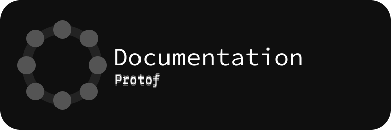

</img>
<h1>Look</h1>

   
 
  

 

<h1>Documentation</h1>

<a href="https://glint.gitbook.io/protof">
</img>
</a>
 
 ⬆️ click this  ⬆️

<h1>hello! hi! hello!</h1>

This is a universal console utility for developers! Here, at the time of version 0.2, you can create sh scripts, which in terms of functionality, in fact, can be called an interpreter, and there is also a command for formatting your code in a certain number of languages, using other utilities. I put everything in one pile, made it all convenient, and now you can use it in several commands

The list of supported languages at the moment:

<ul>
  <li>
    Java
  </li>
    <li>
    Python
  </li>
    <li>
    Rust
  </li>
    <li>
    JavaScript
  </li>
    <li>
    TypeScript
  </li>
    <li>
    JSX
  </li>
    <li>
    Flow
  </li>
    <li>
    JSON
  </li>
    <li>
    HTML
  </li>
    <li>
    Vue
  </li>
    <li>
    Angular
  </li>
    <li>
    Ember / Handlebars
  </li>
    <li>
    GraphQL
  </li>
    <li>
    CSS
  </li>
    <li>
    Less
  </li>
    <li>
    Markdown
  </li>
    <li>
    YAML
  </li>
</ul>

Yes, I have combined several language formatters into one utility, and if they are not installed, they will be installed by you (this should be the case, but there are some bugs that I cannot fix at the moment)

<h1>An illustrative example of code formatting:</h1>
<pre><code>

// before
fn main() {
let number = 5;

    if number < 0 {
        println!("Nubmer is negative");
    } else if number == 0 {
        println!("Number is zero");
    } else if number > 0 && number < 10 {
        println!("Number is positive and less than 10");
    } else {
        println!("Number is positive and greater than or equal to 10");
    }
}
</pre></code>
<pre><code>
  // after
fn main() {
    let number = 5;

    match number {
        n if n < 0 => println!("Nubmer is negative"),
        0 => println!("Number is zero"),
        n if n > 0 && n < 10 => println!("Number is positive and less than 10"),
        _ => println!("Number is positive and greater than or equal to 10"),
    }
}

</pre></code>

<h1>Screenshots</h1>

<h1>How to use?</h1>

1. Just download latest release

2. Move file in "protof.exe" to some directory

3. Place protof.exe in PATH

<h1>How to build?</h1>
<pre><code>cargo build</pre></code>

its all.

There are no releases on macos and linux yet, as it does not work well on unix-like operating systems
